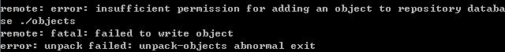

# FAQ

## Q：如何修改Git过去提交的message？

1. 运行 **git rebase -i ( message hash | HEAD~n)**，选择要修改的message行，将pick改为edit，保存退出；
2. 运行 **git commit -amend -m "new message"**，将新的message提交；
3. 运行 **git rebase --continue**提交修改；
4. 如果已提交到远程仓库，需要运行 **git push <repo> <branch> --force**更新远程git仓库的message。

###References:
https://help.github.com/articles/changing-a-commit-message/


## Q：Windows7如何在CopSSH中新建Git远程仓库？

1. 进入CopSSH/home/**{user}**目录下，运行 **git init --bare {repo};**；
2. 右键点击“**{repo}**”目录，选择属性->安全->编辑->添加，添加**{user}**；
3. 设置**{user}**权限为：**修改**，**读取和执行**；

> 如果在安全选项卡未为**{repo}**添加**{user}**或设置权限，在提交源码到远程仓库时将显示如下错误信息：
> 

### References:
https://github.com/msysgit/msysgit/wiki/Setting-up-a-Git-server-on-Windows-using-Git-for-Windows-and-CopSSH


## Q：Git乱码解决方案？

运行git-bash命令，依次输入如下命令：
```bash
git config --global core.quotepath false          # 显示 status 编码
git config --global gui.encoding utf-8            # 图形界面编码
git config --global i18n.commit.encoding utf-8    # 提交信息编码
git config --global i18n.logoutputencoding (utf-8|gbk)  # 输出 log 编码
export LESSCHARSET=utf-8
```

### References:
http://howiefh.github.io/2014/10/11/git-encoding/


## Q：Git如何为远程仓库(origin)设置push默认分值(branch)？

运行git-bash命令，依次输入如下命令：
```bash
git push --set-upstream {repo} {branch}
```

